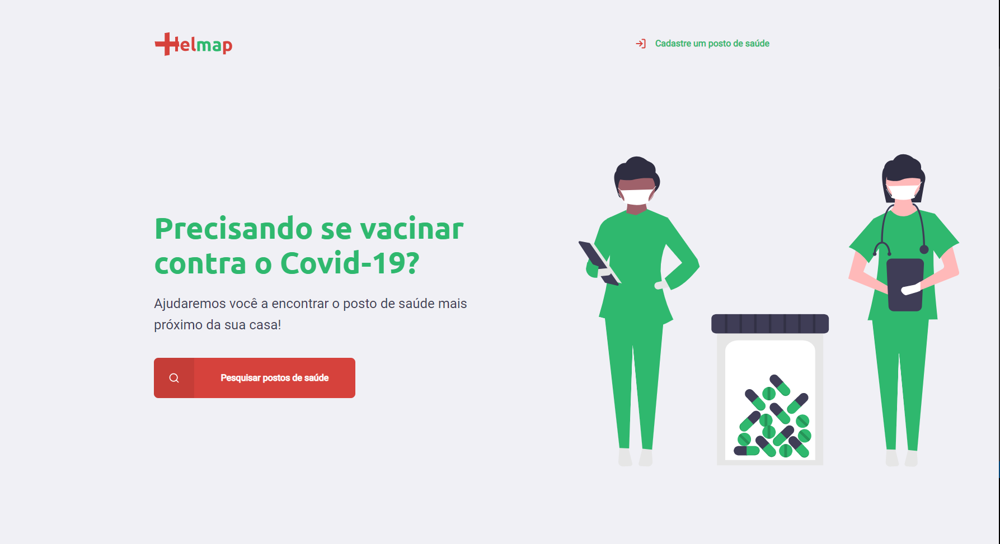
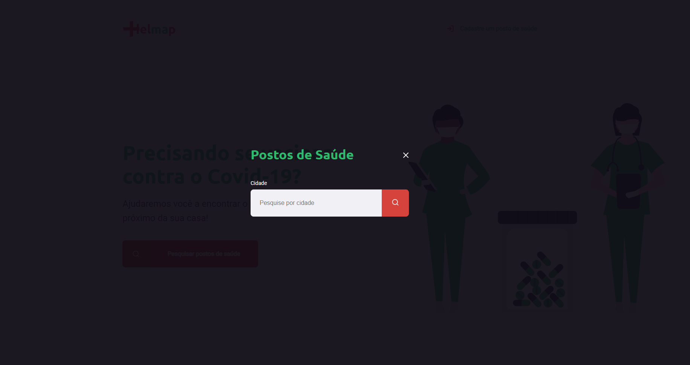
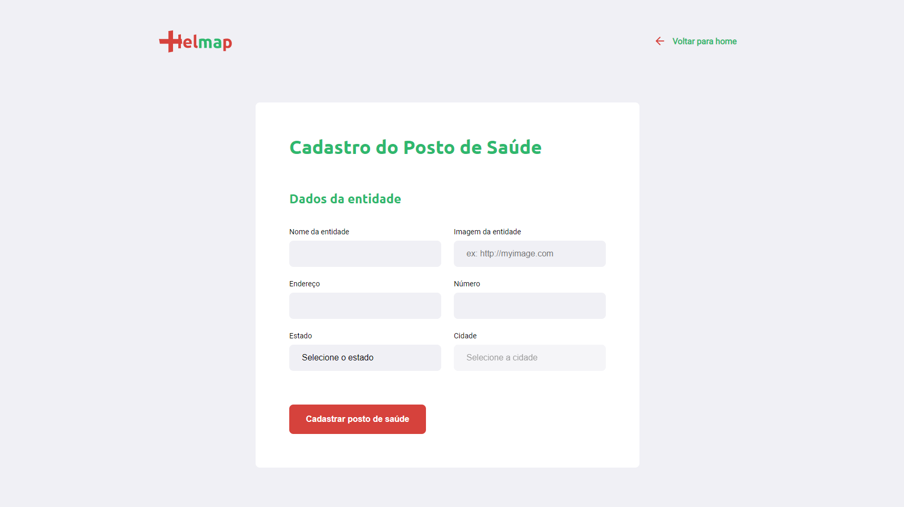
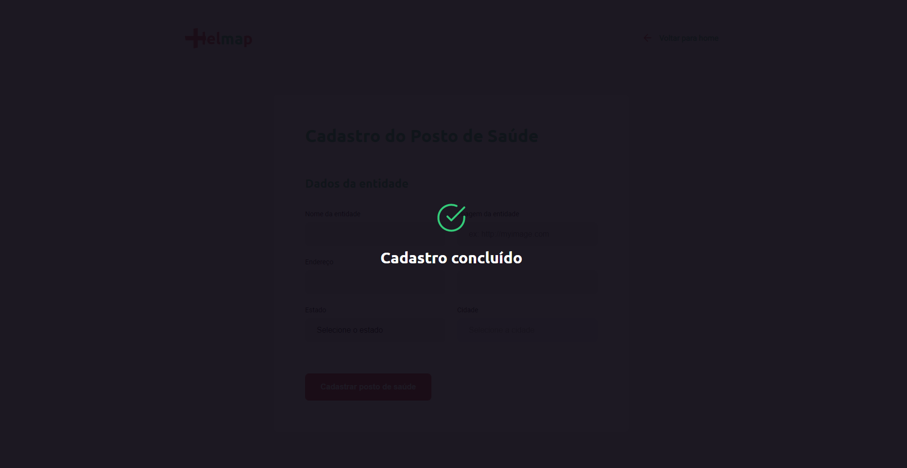
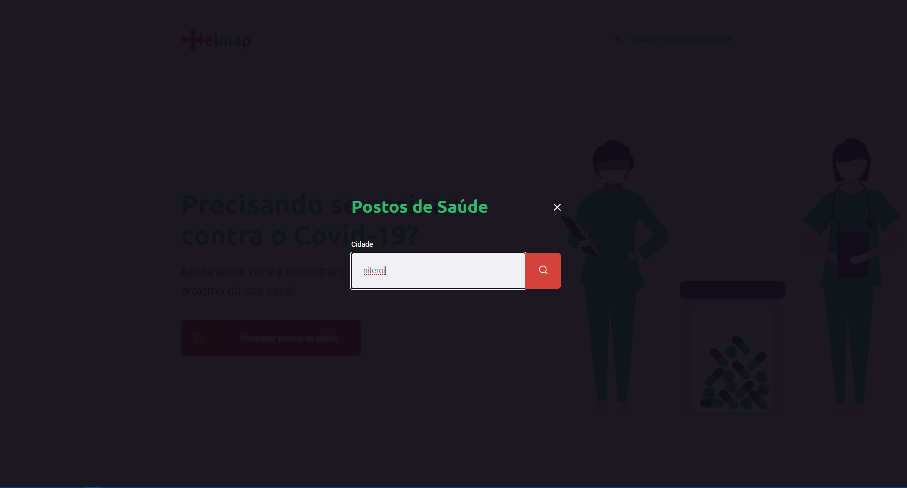
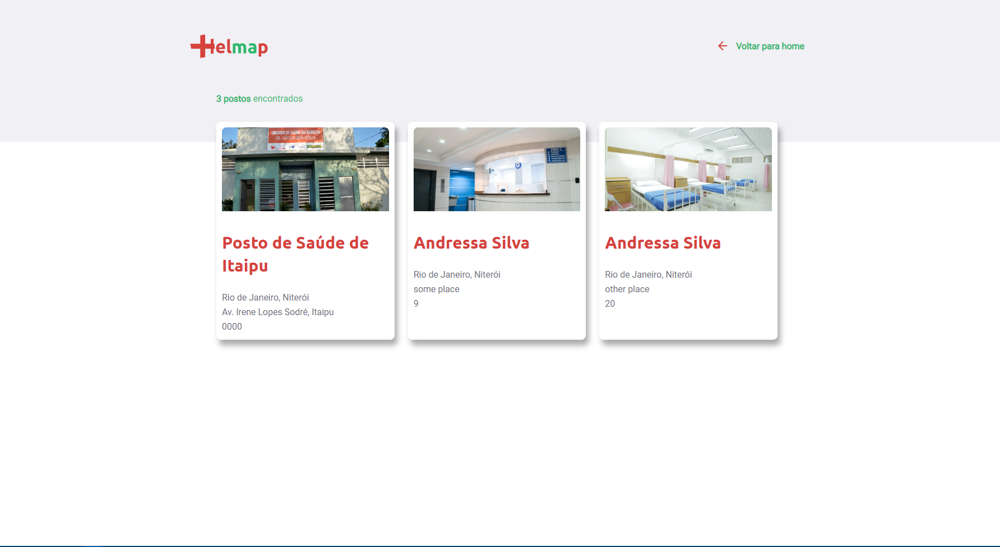

# Helmap

## Encontre os postos de saúde mais próximos da sua localidade!

### Funcionalidades trabalhadas

* Cadastro de entidade
* Pesquisa a partir da cidade
* Listagem de resultados puxados do database

### PRINTS

### Linguagens e tecnologias

* *Front-end:* HTML5, CSS e Javascript

* *Back-end:* Javascript, Node.js, Template Engine: NunJucks e Banco de dados: SQLite 

### Rocketseat

Inspirado no projeto Ecoleta trabalhado no bootcamp da Rocketseat 
https://rocketseat.com.br

#boracodar :)
